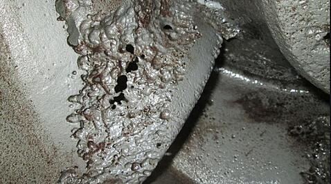
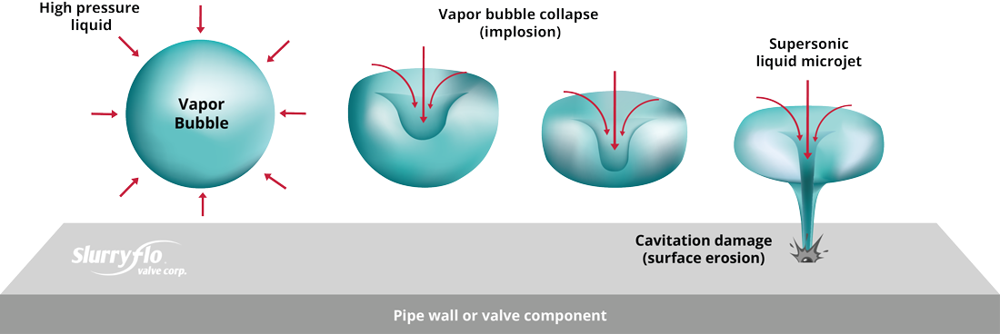
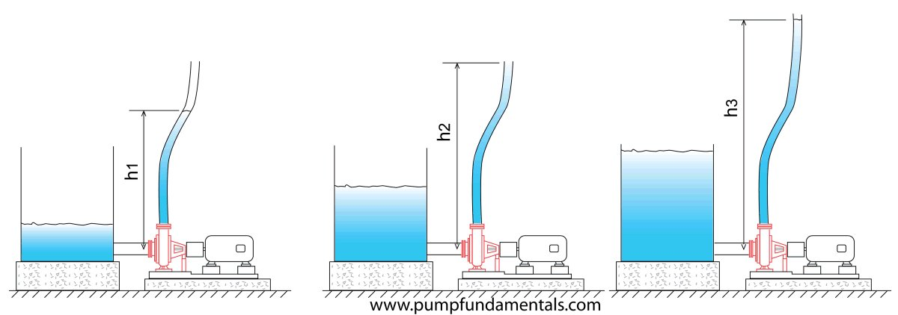
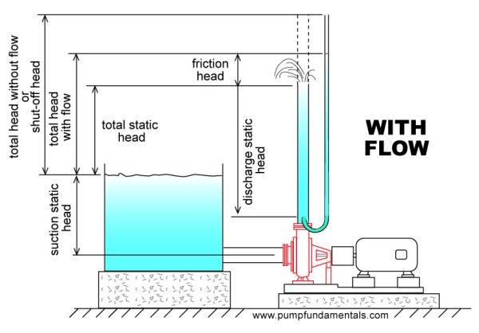

# Pump notes 
José L. Yáñez P. 09/2022

## Definition

A pump is a mechanical device that turns mechanical energy into energy supplied to a fluid that manifest in form of pressure, velocity or height.

According to API, pumps are classified as follows:

- Pumps
  - Positive displacement 
    - Reciprocant
      - Diafragm
      -
    - Rotatory

Given the classification above pumps come in a huge variety if we as well take into account different necessities from users being that cuadal, nature of fluid (material), being it mixtures, organic solvents, different types of water, oils, viscous fluids, specific conditions, etc.

## Important concepts regarding pumps

### Cavitation

Cavitation is a phenomenom that happens when a incompresible fluid enters the pump through suction, fluid losses presure and it's speed increases. This provokes fluid to be vaporized, producing bubbles. When these bubbles implodes inside the pump, then corrosion, erotion, fatigue, vibrations, noise occurs. This produces damage on the internal walls of the pump. Thus, it's total capacity to transport fluids decreases. Changing some variables can help to prevent cavitation.

### Steam pressure

The pressure that steam applies to its container's walls given a temperature. In pumps, steam pressure sets the limit of how low the total pressure of the system can be before fluid starts to flash (be vaporized).

### Head

Energy in terms of fluid column (Bernoulli principle, hydrostatic pressure).

### Static suction head

Difference between the highest level of fluid in a tank and the height of the center of the suction of the pump.

### Friction head

Energy lost by the friction between the fluid and material walls and accesories.

### Speed head

Kinetic energy of the fluid.

### Static discharge head

The difference between the height of the center of the discharge of the pump and the final discharge height of the fluid.

### Total discharge head

Sum of static discharge head plus friction head.

### Total static head

Difference between static discharge head and static suction head.

### Total dynamic head

Sum of total discharge head plus static suction head, or total discharge head minus static suction head.

### Net Positive Suction Head (NPSH)

Difference between suction pressure in the impulsor minus steam pressure of the fluid at the working temperature. Working pressure MUST be higher than the steam pressure of the fluid. 

### Hydraulic Power or Water Power (WHP)

Power supplied by the pump to the fluid.

### Power-at-break or break power (BHP)

Power measured on pump axis (nominal power).

### Eficency

Ratio of outlet power vs inlet power.

## Pump calculations

### Head

Taking in consideration a static fluid column:

$$
\Delta P = \rho g h \  [=] \  \frac {N} {m²} 
$$ 
eq 1

Considering: 

$$
h = z_1 - z_2
$$

eq 2

We have:

$$
\Delta P = \rho g (z_1 - z_2) = \rho g z_1 - \rho g z_2 = P_1 - P_2
$$

But

$$
Z = \frac {P} {w}
$$

Then:

$$
\frac {\Delta P} {w} = H = \frac {P_1 - P_2} {w} \  [=] \ m
$$

Using specific gravity (relative density):

$$
H = \frac {P_1 - P_2} {RD \ \rho _ {H_2 O} \ g}
$$

At normal conditions, density of water can be considered as 1000 kg/m³. Average gravity value is 9.81 m/s².

Thus:

$$
H = \frac {P_1 - P_2} {RD \ (9810 \ {\frac {Pa} {m}})} = [m]
$$

Making conversion for Imperial/US unit system:

$$
H = \frac {P_1 - P_2} {RD \ (9810 \ {\frac {Pa} {m}})} \bullet \frac {101325 \ Pa}{14.9 \frac {lb} {in²}} \bullet \frac {1\ in²} {(0.254\ m)²} \bullet \frac {1\ ft²} {144\ in²} 