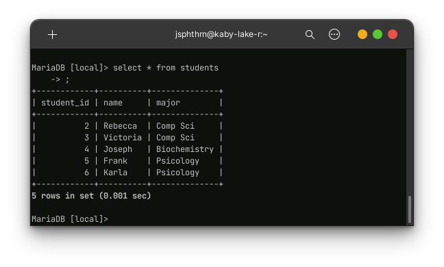

# NOTES ON SQL (MariaDB)

## Database management

### Login into mysql/mariadb server:

```bash
mysql -u user_name -p
```
Prompt will ask for password

### Create a new database:

```sql
CREATE DATABASE my_new_database;
```

### Show existing databases:

```sql
SHOW DATABASES
```

Note: database, table and column names are case sensitive.

### Select a database to work on:

```sql
USE local;
```

## Tables

### Create a new table with a single primary key:

```sql
CREATE TABLE student (
  student_id INT PRIMARY KEY,
  name VARCHAR(32),
  major, VARCHAR(16)
);
```

or

```sql
CREATE TABLE students (
  student_id INT,
  name VARCHAR(32),
  major, VARCHAR(16),
  PRIMARY KEY(student_id)
);
```

This query creates a table *students* with the following attributes:

- student_id of type **INT** and set as **PRIMARY KEY**.
- name of type **string** with 32 characters allocated.
- major of type **string** with 16 characters allocated.

### Show info about a table and it's attributes:

```sql
DESCRIBE students;
```

For the table previously created:


### Erase (drop) a table:

```sql
DROP TABLE students;
```

### Add new attribute to a table:

```sql
ALTER TABLE students ADD gpa DECIMAL(2,2);
```
This query adds a new column called gpa and it is formated as a decimal number.


### Remove a column from a table:

```sql
ALTER TABLE students DROP COLUMN gpa;
```

## Data insertion

### Insert a row of data into a table:

```sql
INSERT INTO students VALUES (2014031452, 'Joseph', 'Chem Eng');
```

### Insert a entry with a custom set of attributes:

```sql
INSERT INTO students (student_id, name)
VALUES (2019010968, 'Rebecca');
```

With this, we are only issuing a new entry but that entry will only have the attributes student_id and name.

### Visualize all the entries on a table:

```sql
SELECT * FROM students
```


## Constraints

Constraints are a set of conditions assigned to an attribute inside a table. These are specified at the attribute creation. Some examples of these:

- `NOT NULL`: prevents from issuing a new entry if the attribute in this entry is NULL.

- `UNIQUE`: prevents from issuing a new entry if some other entry has the same value for the same attribute.

- `DEFAULT 'default_value'`: if no value is specified for the attirbute, the attribute takes 'default_value'.

- `AUTO_INCREMENT`: when issuing a new entry, this attribute will the previous entry's attribute value incremented by 1 (if this attribute is not specified).

- `PRIMARY KEY`: specifies a particular attribute to be the primary key of the table.

Example:

```sql
CREATE TABLE trainees(
  entry_id INT AUTO_INCREMENT PRIMARY KEY,
  ssn_num INT,
  first_name VARCHAR(24) NOT NULL,
  last_name VARCHAR(24) NOT NULL,
  branch VARCHAR(16) DEFAULT 'plant',
  entry_date DATE,
  end_date DATE,
  stat VARCHAR(24) DEFAULT 'active'
);
```


## Update table

### Insert a new complete entry into table:



Insert a new entry:


```sql
INSERT INTO students VALUES(1, 'Elizabeth', 'Biochemistry');
```

New table:


## Basic queries

### Show all the attributes from a single table

```sql
SELECT * FROM students;
```


### Show some specific attributes from a single table

```sql
SELECT student_id, major FROM students;
```


Being more specific:

```sql
SELECT students.student_id, students.major FROM students;
```


Output is the same for both queries.

  